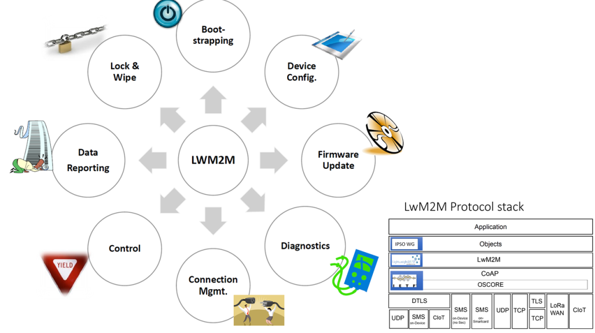

# Lightweight M2M (LwM2M)
***

> [⇧ **Home**](https://github.com/iotkitv3/intro)

 

Quelle: [OMA SpecWorks](https://omaspecworks.org/what-is-oma-specworks/iot/lightweight-m2m-lwm2m/)

- - - 

Lightweight M2M (LwM2M) ist ein Protokoll von der Open Mobile Alliance für M2M oder IoT Geräte.

Der LwM2M-Standard definiert das Kommunikationsprotokoll der Anwendungsschicht zwischen einem LwM2M-Server und einem LwM2M-Client (IoT-Gerät). Es ermöglicht die Verwaltung von IoT-Geräten und die Koexistenz von Geräten und Systemen verschiedener Anbieter in einem IoT-Ökosystem.

LwM2M wurde ursprünglich auf CoAP aufgebaut, aber spätere LwM2M-Versionen unterstützen auch andere Übertragungsprotokolle.

Die Geräteverwaltungsfunktionen von LwM2M umfassen die Remote-Bereitstellung von Sicherheitsanmeldeinformationen, Firmware-Updates, Konnektivitätsverwaltung (z. B. für Mobilfunk und WLAN), Remote-Gerätediagnose und Fehlerbehebung.

Die Service-Aktivierungsfunktionen von LwM2M umfassen Sensor- und Zählerstände, Fernbetätigung und Konfiguration von Host-Geräten.

### Geräteressourcenmodell

Quelle: Pelion

- - -
Das LwM2M Geräteressourcenmodell basiert auf einer hierarchischen Datenstruktur und unterscheidet zwischen Objekten und Ressourcen:
* Ein Objekt ist eine Sammlung von Ressourcen auf dem Gerät. Beispielsweise könnte es eine "Schnittstelle" mit einem Temperatursensor darstellen. Ein Objekt kann mehrere Instanzen haben.
* Jede Information von einem Gerät ist eine Ressource. Eine Ressource hat entweder einen statischen Wert oder einen dynamischen Wert. Eine Ressource kann auch ein Array sein. Wenn eine Ressource ein Array von Werten enthält, werden diese Werte als Ressourceninstanzen bezeichnet.

Sie können die Informationen einer Ressource lesen, schreiben oder ausführen.

[OMA LightweightM2M (LwM2M) Object and Resource Registry](http://openmobilealliance.org/wp/OMNA/LwM2M/LwM2MRegistry.html) ist das Verzeichnis der Standardisierten Ressourcen.

## Pelion

Quelle: Pelion
- - -

[Pelion](https://pelion.com/) wurde ursprünglich als Inkubationseinheit innerhalb von Arm gegründet. 

Es ist eine hundertprozentige Tochtergesellschaft von Arm, geht aber ihren igenen Weg in der IoT-Revolution und baut auf einer soliden Grundlage für Geräte- und Netzwerkkompetenz auf.

Ihr gleichnamiges [Produkt](https://pelion.com/blog/education/a-brief-history-of-iot-and-pelions-journey/) ist ein LwM2M Server mit umfangreicher Funktionalität.

## Beispiel

Das Beispiel verbindet, dass IoTKitV3, mit der [Pelion Cloud](https://portal.mbedcloud.com/) und sendet die Daten vom Temperatorsensor (3303/0/5700) und empfängt die Position von Servo2 (10346/0/5536).

Dafür müssen zuerst die Zugriffsinformationen (Datei `mbed_cloud_dev_credentials.c`) erstellt werden. Dies geht, am einfachsten, durch Durchspielen das [IoT Connection Tutorial](https://developer.pelion.com/guides/connect-device-to-pelion/). Die so erstellte Datei `mbed_cloud_dev_credentials.c` kann über die vorhandene Datei kopiert und das Programm anschliessend compiliert werden.

### Links

* [OMA LightweightM2M (LwM2M) Object and Resource Registry](http://openmobilealliance.org/wp/OMNA/LwM2M/LwM2MRegistry.html)
* [Pelion Documentation](https://developer.pelion.com/docs/)
* [Pelion API User Guide](https://developer.pelion.com/docs/connectivity/API/Intro/Introduction.htm)
* [Pelion Dashboard](https://portal.mbedcloud.com/)